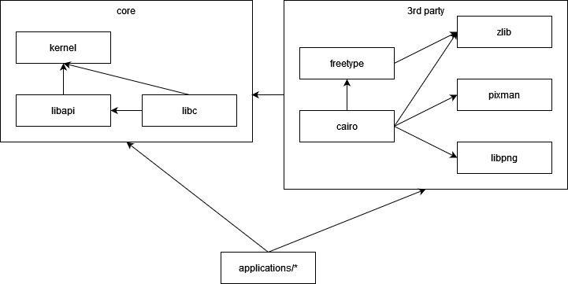

= Building
:toc: left
include::../common/homelink.adoc[]

Getting started
---------------
This document contains an explanation on how to build entire operating system from source.

The project consists of two repositories:

* link:https://github.com/maxdev1/ghost[*ghost*], main repository containing the source code
* link:https://github.com/maxdev1/ghost-sysroot[*ghost-sysroot*], a blueprint for the system root directory

The system root directory (sysroot) is a concept used in cross-compiling. Everything in this
directory is written to the ramdisk, which is mounted as the root folder of the filesystem
when the OS has started.

When cross-compiling libraries and applications on your host system, the headers and
libraries from within this directory are used. This is required to seperate the host
from our target.

Building the toolchain on your host system, depending on some factors, a long and sometimes
tedious process. If you want to do it, skip to the <<Toolchain on host>> section, otherwise
continue with <<Toolchain via Docker>>.

Toolchain via Docker
--------------------
If you want to avoid the hassle, follow these steps to setup the toolchain in Docker:

1. Check out the link:https://github.com/maxdev1/ghost[*ghost*] and link:https://github.com/maxdev1/ghost-sysroot[*ghost-sysroot*] repositories anywhere on your system.

2. Download the link:https://ghostkernel.org/repository/ghost-docker.tar.gz[toolchain Docker image] from here: 

3. Load the image to your local Docker registry:

	docker load --input ghost-docker.tar.gz

3. Run a container from the image, replacing the paths to the respective repositories:
  
  docker run -it --name ghost-toolchain -v C:/Code/ghost:/ghost/source -v C:/Code/ghost-sysroot:/ghost/sysroot ghost-toolchain:1.1

You will now be presented with a shell. Run `cd /ghost/source` and skip to the <<Building>> section below.

Toolchain on host
-----------------

Clone repositories
~~~~~~~~~~~~~~~~~~
. Clone ghost-sysroot to `/ghost/sysroot`
. Clone main repository anywhere (for example `/ghost/source`)

If you want to use a different folder, see the "Tips" section below.

Installing prerequisites
~~~~~~~~~~~~~~~~~~~~~~~~
There are some pre-requisites that you need to install on your host system. Install the following dependencies:

* `apt-get update`
* `apt-get install libmpfr-dev libgmp-dev libmpc-dev`
* `apt-get install autoconf2.69 pkg-config xorriso grub-pc-bin`
* `apt-get install make texinfo flex bison gcc g++ nasm`
* `apt-get install asciidoc asciidoctor`

You may need to `export AUTOCONF=autoconf2.69` depending on your installation.

On Windows
~~~~~~~~~~
The recommended way of building on Windows is using WSL (link:https://learn.microsoft.com/en-us/windows/wsl/install[Windows Subsystem for Linux]).

On Mac OS
~~~~~~~~~
There are quite some prerequisites, so probably setting up a Linux VM is easier.
The least that has to be done to get it working on OS X is to install GCC, build `libmpfr`,
`libgmp` and `libmpc` from source and prepare the environment properly. If you don't like
pain, reconsider Docker.

Build toolchain
~~~~~~~~~~~~~~~
Run the toolchain setup script `toolchain.sh`. It will attempt to do everything that is
necessary to create the toolchain. Once the toolchain was built, add it to your PATH.

Building
--------
To build the system, use the root `build.sh` and its various flags (see `--help`).

After setting up the toolchain, simply run `./build.sh` and let it execute all targets. The first
build will take some time, because the ported libraries (like cairo) need to be built.

Done? *Congratulations!* In the main folder you will now find the bootable ISO image `ghost.iso`.

NOTE: On some systems while running `build.sh`, the configure scripts of some ports
	might hang at either "checking for suffix of executables" or "checking whether
	we are crosscompiling". Run `killall conftest` to get it running again.

Library dependency
------------------
To give a small overview on the dependencies, libapi is the lowest layer library that provides
wrapping of system calls. On top of this is the libc that utilizes libapi.

Third-party software
--------------------
To install third-party libraries, it is usually necessary to provide some parameters to the
`./configure` script:

* `--host=i686-ghost` to set the correct host
* `--prefix=/system` to install libraries to the correct folder

There is also a simplified port installation script in `patches/ports` that allows automatically
downloads, patches and installs some third-party libraries.

Creating a bootable USB stick
-----------------------------
You can create a bootable USB stick with the following steps.

1. Convert the `image.iso` file to an .img 

	hdiutil convert -format UDRO -o converted.img image.iso

2. Find out which drive the USB stick is with

	diskutil list
	
3. Unmount the disk
	
	diskutil unmountDisk /dev/diskN
	
4. Write the image to the stick

	sudo dd if=converted.img of=/dev/rdiskN bs=1m

5. Unmount it again
	
	diskutil unmountDisk /dev/diskN

Tips
----
* To specify a different toolchain base directory, modify `TOOLCHAIN_BASE`, copy the
	`variables.sh.template` to `variables.sh` and specify the variable with an export.
* While binutils and gcc are being built, the log output is redirected to a file named
	`ghost-build.log` in the respective build directory in the temporary folder. If the
	build fails for some reason, you should check this log file.
