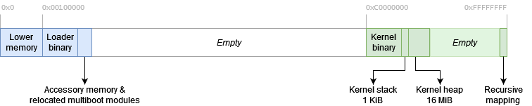

# Loader
:toc: left
:last-update-label!:

include::../common/homelink.adoc[]

About
-----
The loader is a multiboot compliant binary that forms the initial boot code
which is loaded by GRUB on startup.

The loader binary is loaded to `0x00100000`. It itself reserves some memory (in its BSS) that
is used as its own stack.

1. *Logger*
+
At first, the logger (and if possible the COM port serial logger) are initialized.
This provides basic output for informative and debug messages.
+

2. *Memory basics*
+
A basic GDT is set up which contains only kernel segment & data descriptors.
Next, space for the physical memory bitmap is allocated and a `g_bitmap_page_allocator`
is initialized writing to this area. The GRUB memory map is now interpreted
and all free physical pages are marked in the bitmap.
+

3. *Paging*
+
A page directory is allocated. The directory maps recursively.
The memory from `0x00000000` to the end of all memory used by the loader is identity-mapped.
The remaining multiboot-modules get relocated so they are mapped after the end
of the loader binary.
Then, paging is enabled.
+

4. *Loading kernel*
+
The kernel itself is a simple ELF32 binary that has `0xC0000000` as the start address.
The loader searches for a module at `"/boot/kernel"` and loads it into memory.
After loading the kernel, the rest of the page tables in the kernel area are
pre-allocated and 0'ed.
A initialization stack is allocated after the kernel image, and after the stack
the kernel heap is allocated with an initial size of 16MiB.
+

5. *Enter kernel main*
+
The loader finally switches to the prepared kernel stack and enters the kernels main
entry function
+

Visualization
-------------
When the kernel is entered, the memory in the prepared page directory has the following layout.

