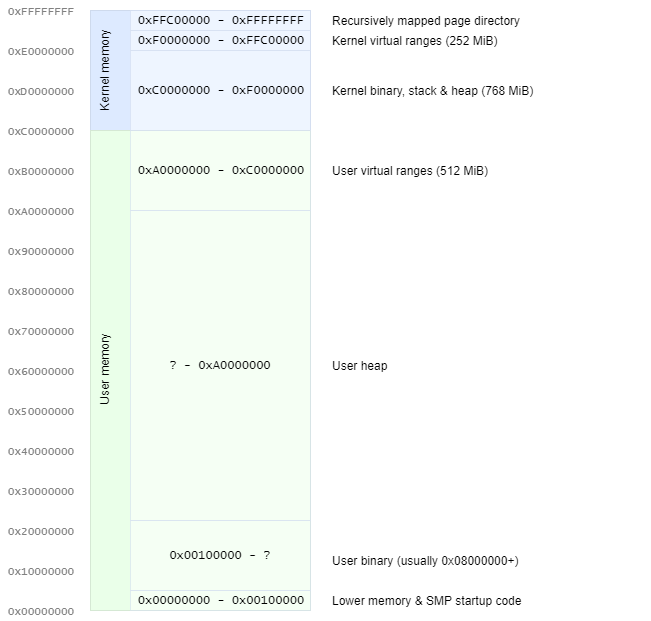

# Memory layout documentation
:toc: left
:last-update-label!:

include::../common/homelink.adoc[]

About
-----
This section describes the memory layouting and management.

Address spaces
--------------
Each <<threads#Processes,process>> has its own address space. All threads of
the same process share the same address space and therefore have access to the
same regions of memory.

The layout of each address space looks as follows.

The _kernel memory_ part of the layout is identical for all processes in the system.

|=====
| *Recursively mapped page directory* | Contains the page directory
| *Kernel virtual ranges* | Used whenever a chunk of the virtual address space in the kernel area is needed.
| *Kernel binary, stack & heap* | The kernel binary image is loaded to this area. Right after it, the kernel setup stack is created. Anything after is used as heap area for the kernel.
| *User virtual ranges* | Used whenever a chunk of the virtual address space in the user area is needed.
| *User heap* | The remaining memory after the user binary is used as the kernel heap area.
| *User binary* | The user binary image is loaded to this area.
| *Lower memory* | The lower memory area is used for SMP setup and VM86 calls.
|=====

[[Stacks]]
Stacks
------
Each thread has two stacks, a user space stack and a kernel space stack.

Kernel space stack
~~~~~~~~~~~~~~~~~~
The kernel space stack is the one that the kernel operates on during system
calls and where the state of the thread is stored during interruptions. It is
statically assigned to 1 page and mapped into <<Kernelspace,kernel space>>.
It is not accessible by the userspace code.

User space stack
~~~~~~~~~~~~~~~~
The user space stack is the one that the application operates on. On thread
creation, a virtual address range of 16 pages is reserved and the last page
is mapped as a physical page. The stack starts at the end of this page.

image::../diagrams/Stack-Initialization.png[]

This allows the stack to grow dynamically without reserving more physical
memory than necessary. When the stack overflows, a page fault is triggered
and the kernel handles the situation by inserting a new physical page.

image::../diagrams/Stack-Overflow.png[]

Address range pools
--------------------
The `g_address_range_pool` is an allocator for ranges of addresses. The kernel
has one main allocator for virtual ranges in the kernel space. Each process has an
allocator assigned to manage ranges in the user space.

Chunk allocator
---------------
The `g_chunk_allocator` a simple allocator that is used by the kernel heap.
It keeps a list of all free chunks and merges them when possibly.
